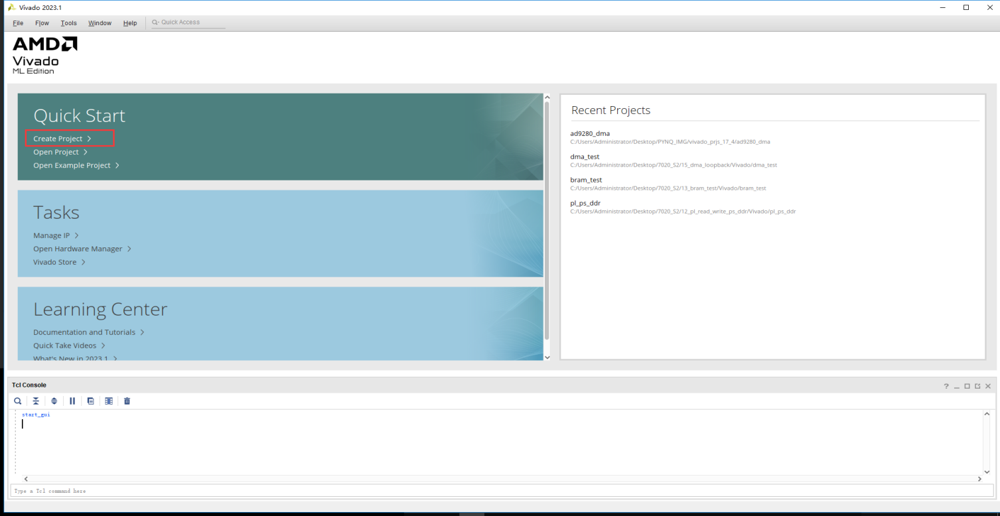
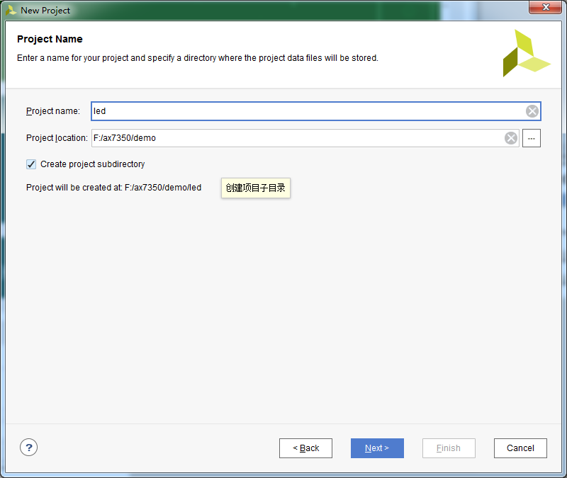
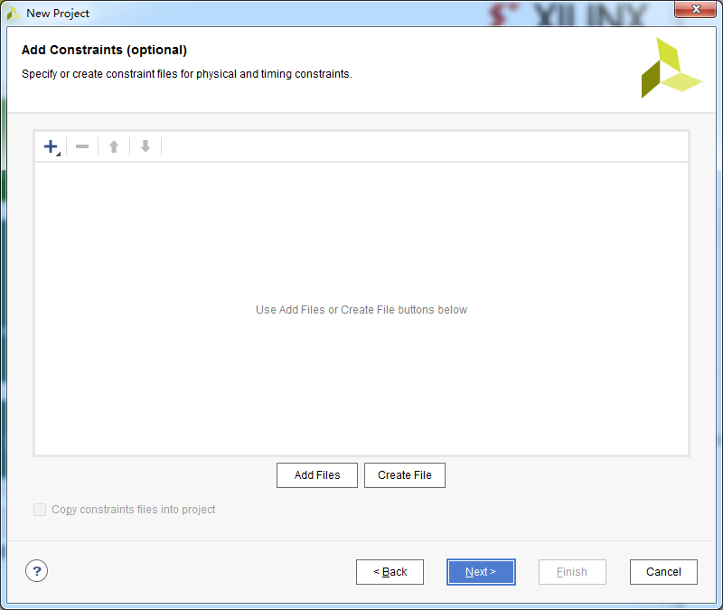
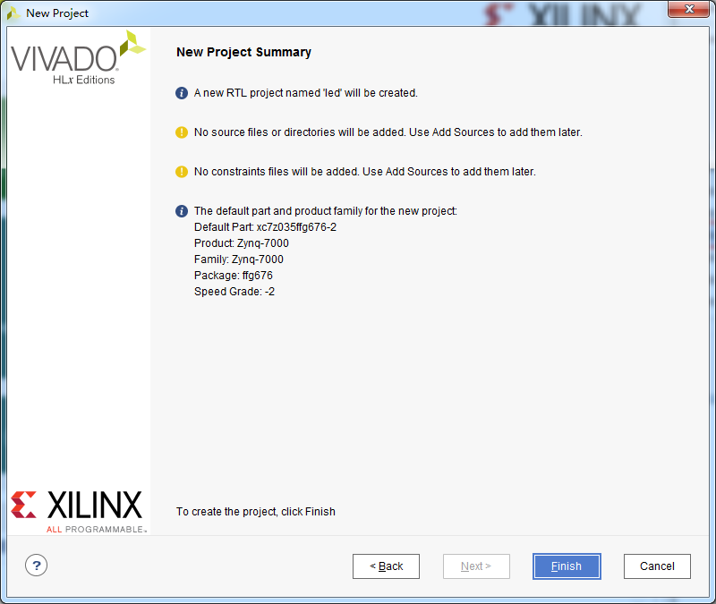
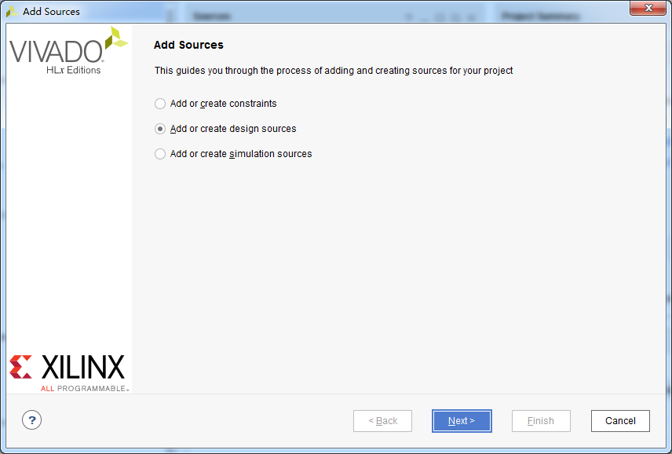
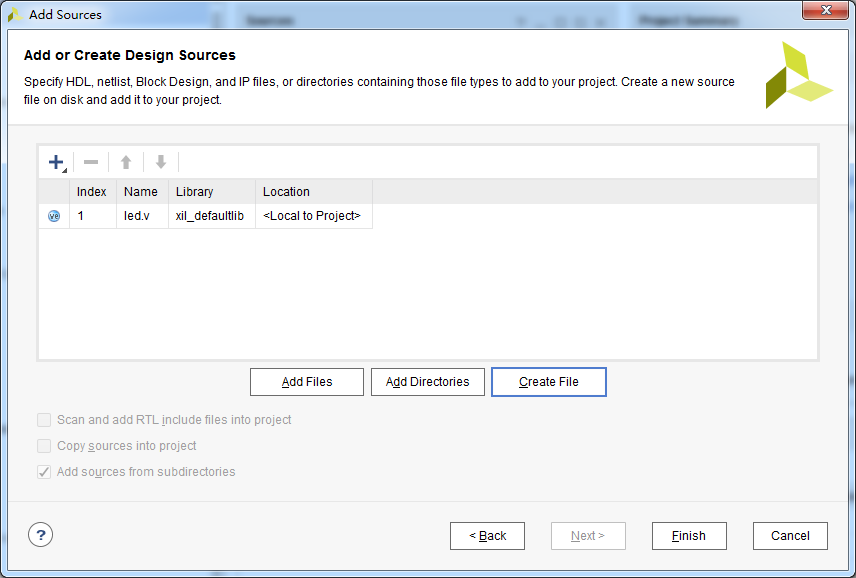
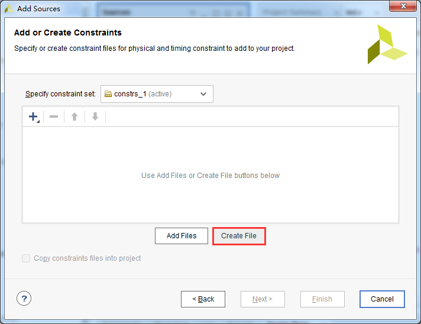
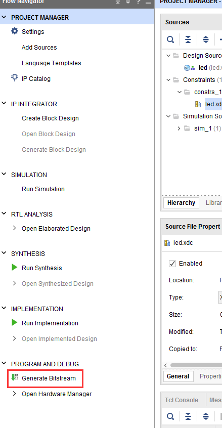
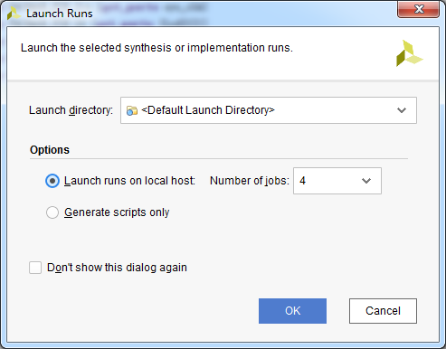
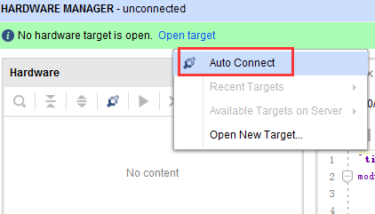

PL的“Hello World”LED实验
=======================================

**实验VIvado工程为“led”。**

对于ZYNQ来说PL（FPGA）开发是至关重要的，这也是ZYNQ比其他ARM的有优势的地方，可以定制化很多ARM端的外设，在定制ARM端的外设之前先让我们通过一个LED例程来熟悉PL（FPGA）的开发流程，熟悉Vivado软件的基本操作，这个开发流程和不带ARM的FPGA芯片完全一致。

在本例程中，我们要做的是LED灯控制实验，每秒钟控制开发板上的LED灯翻转一次，实现亮、灭、亮、灭的控制。会控制LED灯，其它外设也慢慢就会了。

LED硬件介绍
-----------

.. image:: images/04_media/image1.png
   :width: 6.00417in
   :height: 1.14859in

PL端只能直接控制PL端的LED，PS端的外设是无法直接控制的，我们可以看到4颗LED通过三极管连接到3.3V电源，当三极管导通LED就会亮，只要连接到三极管的IO为高电平，三极管就会导通。无论是学习FPGA还是学习ARM，基本的硬件知识还是要掌握，例如看原理图。

从原理图我们可以知道四个LED对应的ZYNQ芯片的管脚情况如下：

PL_LED1 —— F5

PL_LED2 —— E5

PL_LED3 —— G5

PL_LED4 —— G6

创建Vivado工程
--------------

1) 启动Vivado，在Windows中可以通过双击Vivado快捷方式启动

.. image:: images/04_media/image2.png
   :alt: C:/Users/Administrator/Desktop/vivado_2023.1/AX7010_2023.1/7010_S1文档/images/images_5/image133.pngimage133
   :width: 0.7916in
   :height: 0.85in

2) 在Vivado开发环境里点击“Create New Project”，创建一个新的工程。

3) 弹出一个建立新工程的向导，点击“Next”

.. image:: images/04_media/image4.png
   :alt: C:/Users/Administrator/Desktop/vivado_2023.1/AX7010_2023.1/7010_S1文档/images/images_5/image135.pngimage135
   :width: 5.57778in
   :height: 4.07917in

1) 在弹出的对话框中输入工程名和工程存放的目录，我们这里取一个led的工程名。需要注意工程路径“Project
   location”不能有中文空格，路径名称也不能太长。

2) 在工程类型中选择“RTL Project”

3) 目标语言“Target language”选择“Verilog”

.. image:: images/04_media/image7.png
   :width: 4.96728in
   :height: 4.19177in

4) 点击“Next”，不添加任何文件

5) 在“Default
   Part”选项中，器件家族“Family”选择“Zynq-7000”，封装类型“Package”选择“ffg676”,减少我们选择范围。在下拉列表中选择“xc7z035ffg672-2”,“-2”表示速率等级，数字越大，性能越好。

.. image:: images/04_media/image9.png
   :width: 4.85742in
   :height: 4.09907in

6) 点击“Finish”就可以完成以后名为“led”工程的创建。

7) Vivado软件界面

.. image:: images/04_media/image11.png
   :width: 4.61346in
   :height: 3.97672in

创建Verilog文件点亮LED
----------------------

1) 点击Project Manager下的Add Sources图标（或者使用快捷键Alt+A）

.. image:: images/04_media/image12.png
   :width: 3.88736in
   :height: 2.26719in

2) 选择添加或创建设计源文件“Add or create design sources”,点击“Next”

3) 选择创建文件“Create File”

.. image:: images/04_media/image14.png
   :width: 5.19748in
   :height: 3.5094in

4) 文件名“File name”设置为“led”，点击“OK”

.. image:: images/04_media/image15.png
   :width: 4.86244in
   :height: 3.28317in

5) 点击“Finish”,完成“led.v”文件添加

6) 在弹出的模块定义“Define
   Module”,中可以指定“led.v”文件的模块名称“Module
   name”,这里默认不变为“led”，还可以指定一些端口，这里暂时不指定，点击“OK”。

.. image:: images/04_media/image17.png
   :width: 4.48908in
   :height: 3.21372in

7) 在弹出的对话框中选择“Yes”

.. image:: images/04_media/image18.png
   :width: 4.33533in
   :height: 3.10366in

8) 双击“led.v”可以打开文件，然后编辑

.. image:: images/04_media/image19.png
   :width: 4.59715in
   :height: 3.00708in

9) 编写“led.v”,这里定义了一个32位的寄存器timer,
   用于循环计数0~49999999(1秒钟), 计数到49999999(1秒)的时候,
   寄存器timer变为0，并翻转四个LED。这样原来LED是灭的话，就会点亮，如果原来LED为亮的话，就会熄灭。编写好后的代码如下：

+-----------------------------------------------------------------------+
| \`timescale 1ns **/** 1ps                                             |
|                                                                       |
| module led(                                                           |
|                                                                       |
| **input** sys_clk\ **,**                                              |
|                                                                       |
| **output** **reg** **[**\ 3\ **:**\ 0\ **]** led                      |
|                                                                       |
| **);**                                                                |
|                                                                       |
| **reg[**\ 31\ **:**\ 0\ **]** timer_cnt\ **;**                        |
|                                                                       |
| always@(posedge sys_clk)                                              |
|                                                                       |
| begin                                                                 |
|                                                                       |
| **if(**\ timer_cnt **>=** 32'd49_999_999\ **)**                       |
|                                                                       |
| begin                                                                 |
|                                                                       |
| led **<=** **~**\ led\ **;**                                          |
|                                                                       |
| timer_cnt **<=** 32'd0\ **;**                                         |
|                                                                       |
| **end**                                                               |
|                                                                       |
| **else**                                                              |
|                                                                       |
| begin                                                                 |
|                                                                       |
| led **<=** led\ **;**                                                 |
|                                                                       |
| timer_cnt **<=** timer_cnt **+** 32'd1\ **;**                         |
|                                                                       |
| **end**                                                               |
|                                                                       |
| end                                                                   |
|                                                                       |
| endmodule                                                             |
+-----------------------------------------------------------------------+

1)  编写好代码后保存,点击菜单File -> Save All Files

.. image:: images/04_media/image20.png
   :width: 5.27195in
   :height: 2.98142in

添加XDC约束文件约束管脚
-----------------------

Vivado使用的约束文件格式为xdc文件,xdc文件里主要是完成管脚的约束,时钟的约束,
以及组的约束。这里我们需要对led.v程序中的输入输出端口分配到FPGA的真实管脚上,
这需要准备一个FPGA的引脚绑定文件.xdc并添加到工程中。

1) 点击Project Manager下的Add Sources

.. image:: images/04_media/image21.png
   :width: 4.01913in
   :height: 3.48702in

2) 选择“Add or create constraints”选项，点击“Next”

.. image:: images/04_media/image22.png
   :width: 4.71745in
   :height: 3.62874in

3) 点击“Create File”按钮

4) 在弹出的对话框里选择File type是XDC,“File name”为“led”, 点击OK按钮

.. image:: images/04_media/image24.png
   :width: 4.73617in
   :height: 3.64314in

5) 点击“Finish”完成

.. image:: images/04_media/image25.png
   :width: 4.80169in
   :height: 3.69353in

6) 这时在Project
   Manager界面下的Constraints目录的constrs_1目录下已经有了一个“led.xdc”文件

.. image:: images/04_media/image26.png
   :width: 3.83866in
   :height: 3.2108in

7) 双击打开这个led.xdc文件，在这个文件里添加以下的引脚定义

+-----------------------------------------------------------------------+
| set_property IOSTANDARD LVCMOS15 [get_ports {led[3]}]                 |
|                                                                       |
| set_property IOSTANDARD LVCMOS15 [get_ports {led[2]}]                 |
|                                                                       |
| set_property IOSTANDARD LVCMOS15 [get_ports {led[1]}]                 |
|                                                                       |
| set_property IOSTANDARD LVCMOS15 [get_ports {led[0]}]                 |
|                                                                       |
| set_property IOSTANDARD LVCMOS18 [get_ports sys_clk]                  |
|                                                                       |
| set_property PACKAGE_PIN J14 [get_ports sys_clk]                      |
|                                                                       |
| set_property PACKAGE_PIN F5 [get_ports {led[0]}]                      |
|                                                                       |
| set_property PACKAGE_PIN E5 [get_ports {led[1]}]                      |
|                                                                       |
| set_property PACKAGE_PIN G5 [get_ports {led[2]}]                      |
|                                                                       |
| set_property PACKAGE_PIN G6 [get_ports {led[3]}]                      |
+-----------------------------------------------------------------------+

下面来介绍一下最基本的XDC编写的语法，普通IO口只需约束引脚号和电压，管脚约束如下：

**set_property PACKAGE_PIN "引脚编号" [get_ports “端口名称”]**

电平信号的约束如下：

**set_property IOSTANDARD "电平标准" [get_ports “端口名称”]**

这里需要注意文字的大小写，端口名称是数组的话用{
}刮起来，端口名称必须和源代码中的名字一致，且端口名字不能和关键字一样。

电平标准中LVCMOS15后面的数字指FPGA的BANK电压，LED所在BANK电压为1.5伏，所以电平标准为“LVCMOS15”，时钟输入FPGA的BANK电压为1.8V，所以电平标准为“LVCMOS18”。

.. image:: images/04_media/image27.png
   :width: 6.00417in
   :height: 5.74936in

1) 完成后选择菜单File -> Save all files保存所有文件

编译工程
--------

1) 编译的过程可以细分为综合、布局布线、生成bit文件等，这里我们直接点击“Generate
   Bitstream”,直接生成bit文件。

2) 在弹出的对话框中可以选择任务数量，这里和CPU核心数有关，一般数字越大，编译越快，点击“OK”

3) 这个时候开始编译，可以看到右上角有个状态信息，在编译过程中可能会被杀毒软件、电脑管家拦截运行，导致无法编译或很长时间没有编译成功。

.. image:: images/04_media/image30.png
   :width: 5.50782in
   :height: 0.40733in

4) 编译中没有任何错误，编译完成，弹出一个对话框让我们选择后续操作，这里选项“Open
   Hardware
   Manger”，点击“OK”，当然，也可以选择“Cancel”，然后在左边导航栏选择“Open
   Hardware Manger”

.. image:: images/04_media/image31.png
   :width: 3.02588in
   :height: 2.86353in

下载调试
--------

1) 连接好开发板的JTAG接口到PC的USB，给开发板上电

在“HARDWARE MANAGER”界面点击“Open target”

.. image:: images/04_media/image32.png
   :width: 4.95218in
   :height: 4.99011in

2) 点击“Auto Connect”

3) 可以看到JTAG扫描到arm和FPGA内核，还有一个XADC，可以检测系统电压、温度

.. image:: images/04_media/image34.png
   :width: 6.00417in
   :height: 3.15325in

4) 选择xc7z035_1，右键“Program Device...”

.. image:: images/04_media/image35.png
   :width: 4.28629in
   :height: 3.37812in

5) 在弹出窗口中点击“Program”

.. image:: images/04_media/image36.png
   :width: 4.74378in
   :height: 2.63785in

6) 等待下载

.. image:: images/04_media/image37.png
   :width: 5.22461in
   :height: 1.43215in

7) 下载完成以后，我们可以看到4颗LED开始每秒变化一次。到此为止Vivado简单流程体验完成。后面的章节会介绍如果把程序烧录到Flash，需要PS系统的配合才能完成，只有PL的工程不能直接烧写Flash。

*ZYNQ-7000开发平台 FPGA教程*    - `Alinx官方网站 <http://www.alinx.com>`_