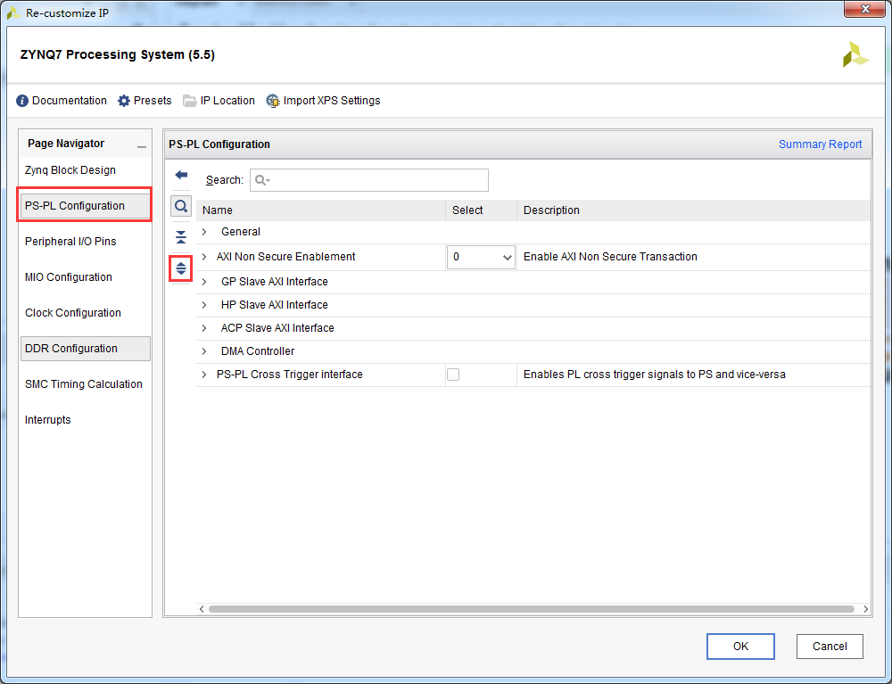
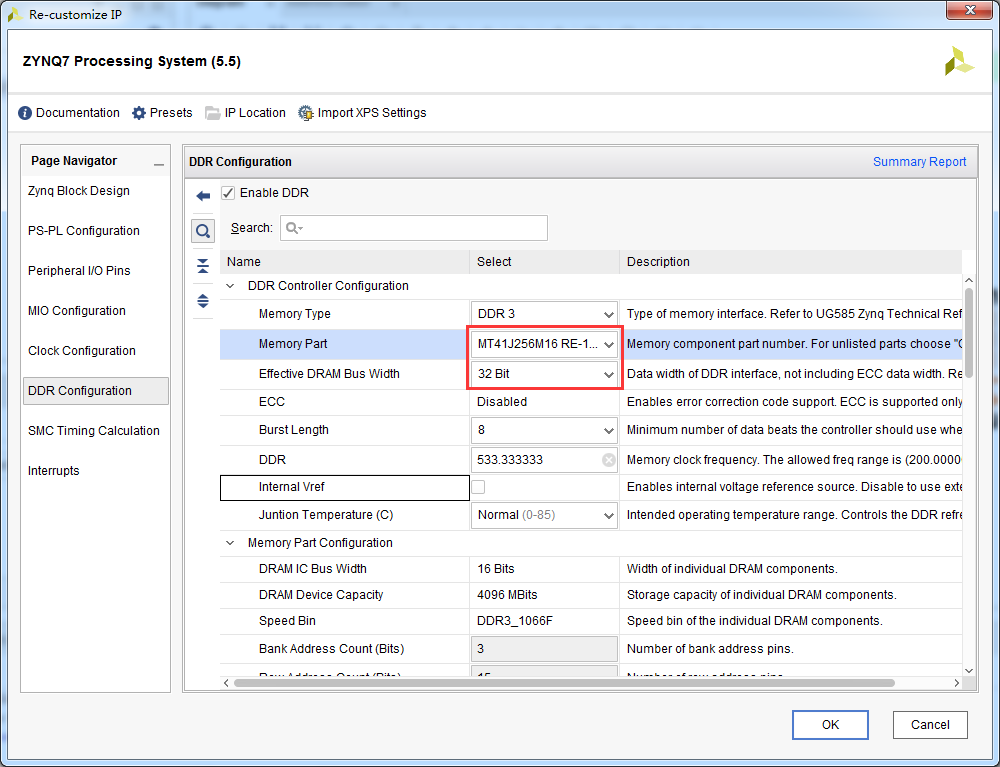
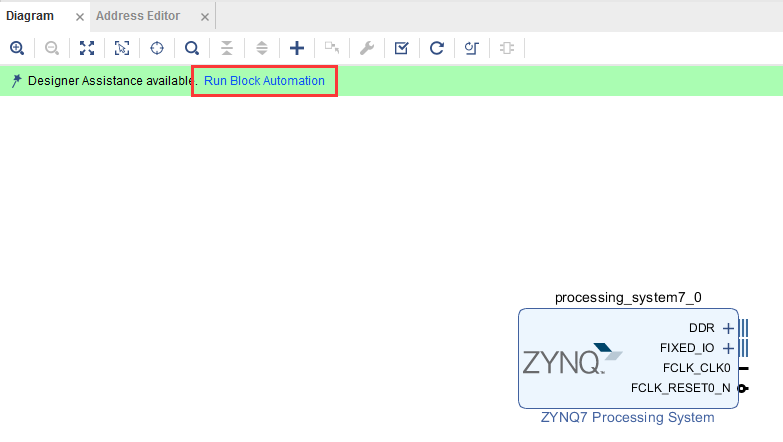
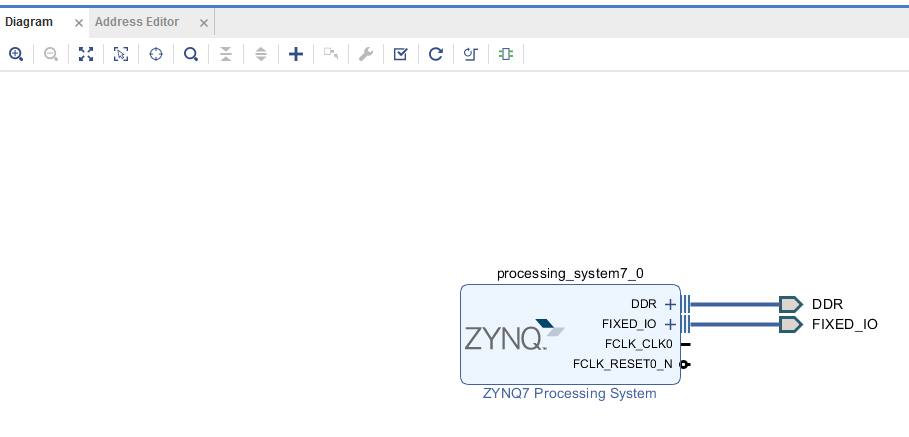
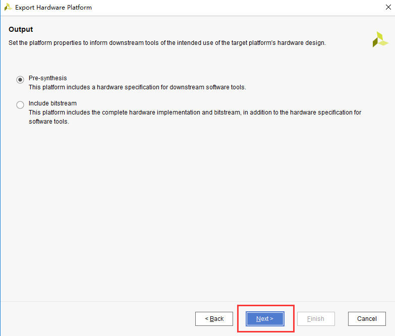
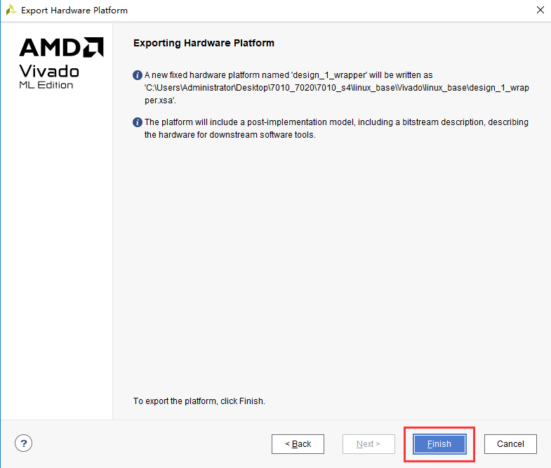
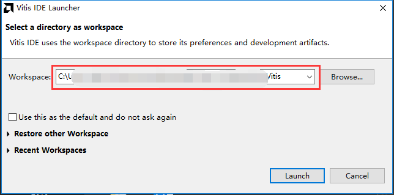
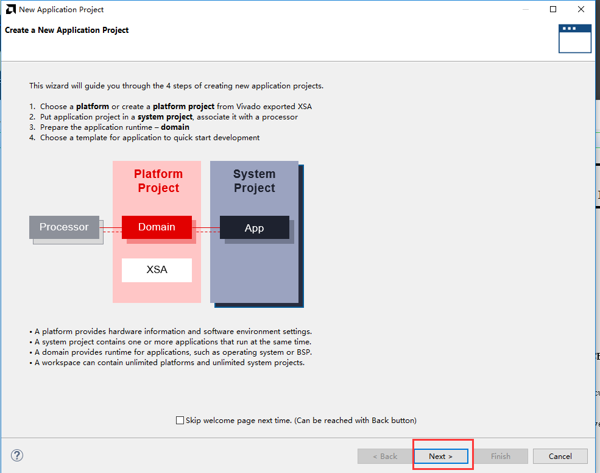
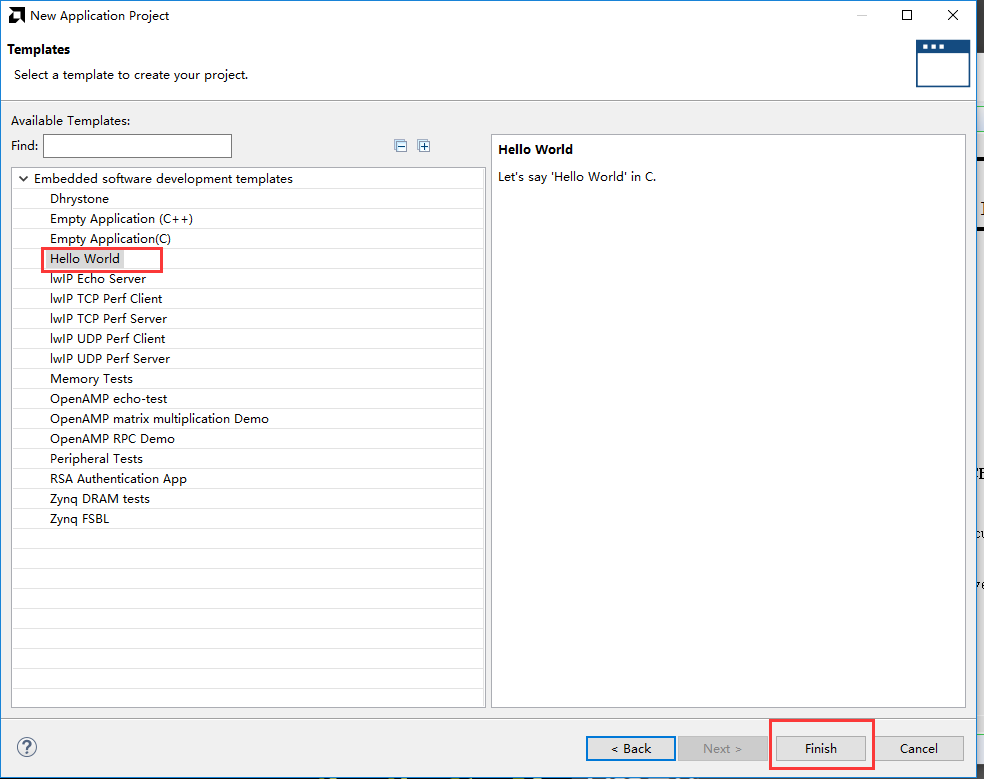
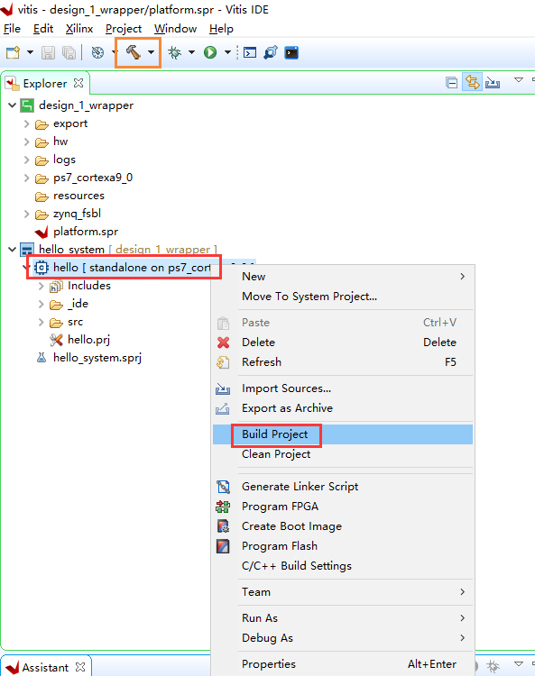

体验ARM，裸机输出“Hello World”
==================================================

**实验VIvado工程为“ps_hello”。**

前面的实验都是在PL端进行的，可以看到和普通FPGA开发流程没有任何区别，ZYNQ的主要优势就是FPGA和ARM的合理结合，这对开发人员提出了更高的要求。从本章开始，我们开始使用ARM，也就是我们说的PS，本章我们使用一个简单的串口打印来体验一下Vivado
Vitis和PS端的特性。

硬件介绍
--------

我们从原理图中可以看到ZYNQ芯片分为PL和PS，PS端的IO分配相对是固定的，不能任意分配，而且不需要在Vivado软件里分配管脚，虽然本实验仅仅使用了PS，但是还要建立一个Vivado工程，用来配置PS管脚。

Vivado工程建立
--------------

1) 创建一个名为“ps_hello”的工程

.. image:: images/09_media/image1.png
   :width: 4.24387in
   :height: 3.57881in

2) 点击“Create Block Design”，创建一个Block设计

.. image:: images/09_media/image2.png
   :width: 5.10002in
   :height: 3.35006in

3) “Design
   name”这里不做修改，保持默认“design_1”，这里可以根据需要修改，不过名字要尽量简短，否则在Windows下编译会有问题。

.. image:: images/09_media/image3.png
   :width: 3.05899in
   :height: 2.26894in

4) 点击“Add IP”快捷图标

.. image:: images/09_media/image4.png
   :width: 4.91128in
   :height: 2.09578in

5) 搜索“zynq”，在搜索结果列表中双击“ZYNQ7 Processing System”

.. image:: images/09_media/image5.png
   :width: 4.05938in
   :height: 3.48053in

6) 双击Block图中的“processing_system7_0”，配置相关参数

.. image:: images/09_media/image6.png
   :width: 6.00417in
   :height: 3.51286in

7) 在“PS-PL Configuration”选项中展开所以项目

8) 取消“M AXI GP0
   interface”接口，这个接口可以扩展PL端的AXI接口外设，所以PL如果要和PS进行数据交互，都要按照AXI总线协议进行，xilinx为我们提供了大量的AXI接口的IP
   核。

.. image:: images/09_media/image8.png
   :width: 5.54809in
   :height: 4.25678in

9) 从原理图中我们可以找到串口连接在PS的MIO12-MIO13上，所以在“Peripheral
   I/O Pins”选项中使能UART1（MIO12-13），Bank 0 电压选择“LVCMOS
   3.3V”，Bank 1电压选择“LVCOMS 1.8
   V”，本实验仅仅使用了一个串口功能，这里就不再使能其他设备。

.. image:: images/09_media/image9.png
   :width: 5.63975in
   :height: 4.32711in

10) 在“Clock
    Configuration”选项卡中我们可以配置PS时钟输入频率，这里默认是33.333333，和板子上一致，不用修改，CPU频率默认666.666666Mhz，这里也不修改。同时PS还可以给PL端提供4路时钟，频率可以配置，这里不需要，所以保持默认即可。

.. image:: images/09_media/image10.png
   :width: 6.00417in
   :height: 4.6067in

11) 在“DDR Configuration”选项卡中可以配置PS端ddr的参数，“Memory
    Part”选择“MT41J256M16 RE-125”,“Effective DRAM Bus Width”，选择“32
    Bit”，到此配置完成，点击“OK”

12) 点击“Run Block Automation”，vivado软件会自动完成一些导出端口的任务

13) 点击“OK”

14) 点击“OK”以后我们可以看到PS端导出一些管脚，包括DDR还有FIXED_IO，按键“Ctrl
    + s”保存设计

15) 选择Block设计，右键“Create HDL Wrapper...”,创建一个Verilog或VHDL文件

.. image:: images/09_media/image15.png
   :width: 4.41646in
   :height: 2.59109in

16) 保持默认选项，点击“OK”

.. image:: images/09_media/image16.png
   :width: 4.07201in
   :height: 2.35414in

17) 展开设计可以看到PS被当成一个普通IP 来使用。

.. image:: images/09_media/image17.png
   :width: 4.61867in
   :height: 3.13997in

18) 选择block设计，右键“Generate Output Products”

.. image:: images/09_media/image18.png
   :width: 4.93999in
   :height: 2.86796in

19) 点击“Generate”

.. image:: images/09_media/image19.png
   :width: 3.19514in
   :height: 4.28981in

20) 在菜单栏“File -> Export -> Export
    Hardware...”导出硬件信息，这里就包含了PS了的配置信息。

.. image:: images/09_media/image20.png
   :width: 3.38542in
   :height: 4.11667in

21) 在弹出的对话框中点击“next”，因为实验仅仅是使用了PS的串口，不需要PL参与，这里就没有使能“Include
    bitstream”，继续步骤直到finish。

.. image:: images/09_media/image21.png
   :width: 4.97014in
   :height: 4.22222in

.. image:: images/09_media/image23.png
   :width: 6.00208in
   :height: 5.08472in

.. image:: images/09_media/image24.png
   :width: 6.00139in
   :height: 5.10833in

此时刚刚的路径下就会输出一个xsa文件，这个文件就是这个文件就包含了Vivado硬件设计的信息，供软件开发人员使用。

Vitis调试
---------

创建Application工程
~~~~~~~~~~~~~~~~~~~

1) Vitis是独立的软件，我们可以通过ToolsLaunch Vitis打开Vitis软件

.. image:: images/09_media/image27.png
   :width: 3.50453in
   :height: 3.20913in

也可以需要双击Vitis软件打开

.. image:: images/09_media/image28.png
   :alt: C:/Users/Administrator/Desktop/vivado_2023.1/AX7010_2023.1/7010_S2文档/images/images_1/image46.pngimage46
   :width: 1.03556in
   :height: 1.22014in

选择之前新建的文件夹，点击”Launch”

2) 启动Vitis之后界面如下，点击“Create Application
   Project”，这个选项会生成APP工程以及Platfrom工程，Platform工程类似于以前版本的hardware
   platform，包含了硬件支持的相关文件以及BSP。

.. image:: images/09_media/image30.png
   :alt: C:/Users/Administrator/Desktop/vivado_2023.1/AX7010_2023.1/7010_S2文档/images/images_1/image48.pngimage48
   :width: 5.97639in
   :height: 3.33264in

3) 点击Next

4) 点击“Create a new platform
   hardware(XSA)，软件已经提供了一些板卡的硬件平台，但对于我们自己的硬件平台，可以选择”+”

.. image:: images/09_media/image32.png
   :alt: C:/Users/Administrator/Desktop/vivado_2023.1/AX7010_2023.1/7010_S2文档/images/images_1/image50.pngimage50
   :width: 6.00417in
   :height: 4.46389in

5) 选择之前生成的xsa，点击打开

.. image:: images/09_media/image33.png
   :alt: C:/Users/Administrator/Desktop/vivado_2023.1/AX7010_2023.1/7010_S2文档/images/images_1/image51.pngimage51
   :width: 6.00417in
   :height: 2.51944in

6) 最下面的Generate boot
   components选项，如果勾选上，软件会自动生成fsbl工程，我们一般选择默认勾选上。点击Next

.. image:: images/09_media/image34.png
   :alt: C:/Users/Administrator/Desktop/vivado_2023.1/AX7010_2023.1/7010_S2文档/images/images_1/image52.pngimage52
   :width: 5.14306in
   :height: 3.95347in

7) 项目名称填入“hello”，也可以根据自己的需要填写,CPU默认选择ps7_cortexa9_0，OS选择standalone，点击Next

.. image:: images/09_media/image35.png
   :alt: C:/Users/Administrator/Desktop/vivado_2023.1/AX7010_2023.1/7010_S2文档/images/images_1/image53.pngimage53
   :width: 5.14167in
   :height: 4.08056in

.. image:: images/09_media/image36.png
   :alt: image535
   :width: 5.09444in
   :height: 4.02222in

8) 模板选择Hello World，点击Finish

9) 完成之后可以看到生成了两个工程，一个是硬件平台工程，即之前所说的Platfrom工程，一个是APP工程

.. image:: images/09_media/image38.png
   :alt: C:/Users/Administrator/Desktop/vivado_2023.1/AX7010_2023.1/7010_S2文档/images/images_1/image55.pngimage55
   :width: 6.07083in
   :height: 3.37708in

10) 展开Platform工程后可以看到里面包含有BSP工程，以及zynq_fsbl工程（此工程即选择Generate
    boot
    components之后的结果）,双击platform.spr即可看到Platform对应生成的BSP工程，可以在这里对BSP进行配置。软件开发人员比较清楚，BSP也就是Board
    Support
    Package板级支持包的意思，里面包含了开发所需要的驱动文件，用于应用程序开发。可以看到Platform下有多个BSP，这是跟以往的Vitis软件不一样的，其中zynq_fsbl即是fsbl的BSP，standalone
    on
    ps7_cortexa9_0即是APP工程的BSP。也可以在Platform里添加BSP，在以后的例程中再讲。

11) 点开BSP，即可看到工程带有的外设驱动，其中Documentation是xilinx提供的驱动的说明文档，Import
    Examples是xilinx提供的example工程，加快学习。

12) 选中APP工程，右键Build
    Project，或者点击菜单栏的“锤子”按键，进行工程编译

13) 可以在Console看到编译过程

.. image:: images/09_media/image42.png
   :width: 4.44942in
   :height: 1.1085in

编译结束，生成elf文件

.. image:: images/09_media/image43.png
   :width: 2.99826in
   :height: 2.28635in

14) 连接JTAG线到开发板、UART的USB线到PC

15) 使用PuTTY软件做为串口终端调试工具，PuTTY是一个免安装的小软件

.. image:: images/09_media/image44.png
   :width: 3.07054in
   :height: 2.94624in

16) 选择Serial，Serial
    line填写COM3，Speed填写115200，COM3串口号根据设备管理器里显示的填写，点击“Open”

.. image:: images/09_media/image45.png
   :width: 4.3799in
   :height: 3.19079in

17) 给开发板上电，准备运行程序，开发板出厂时带有程序，这里可以把运行模式选择JTAG模式，然后重新上电。选择“hello”，右键，可以看到很多选项，本实验要用到这里的“Run
    as”，就是把程序运行起来，“Run as”里又有很对选项，选择第一个“Launch
    on Hardware(System Debuger)”，使用系统调试，直接运行程序。

.. image:: images/09_media/image46.png
   :width: 6.00417in
   :height: 3.53056in

18) 这个时候观察PuTTY软件，即可以看到输出”Hello World”

.. image:: images/09_media/image47.png
   :width: 4.30983in
   :height: 2.70652in

19) 为了保证系统的可靠调试，最好是右键“Run As -> Run Configuration...”

.. image:: images/09_media/image48.png
   :width: 6.00417in
   :height: 3.425in

20) 我们可以看一下里面的配置，其中Reset entire
    system是默认选中的，这是跟以前的Vitis软件不同的。如果系统中还有PL设计，还必须选择“Program
    FPGA”。

.. image:: images/09_media/image49.png
   :width: 6.00417in
   :height: 3.95556in

21) 除了“Run As”，还可以“Debug As”，这样可以设置断点，单步运行

.. image:: images/09_media/image50.png
   :width: 6.00417in
   :height: 3.67222in

22) 进入Debug模式

.. image:: images/09_media/image51.png
   :width: 5.66811in
   :height: 4.12088in

23) 和其他C语言开发IDE一样，可以逐步运行、设置断点等

.. image:: images/09_media/image52.png
   :width: 6.00417in
   :height: 3.35417in

24) 右上角可以切换IDE模式

.. image:: images/09_media/image53.png
   :width: 6.00417in
   :height: 3.36597in

本章小结
--------

本章从FPGA工程师和软件工程师两者角度出发，介绍了ZYNQ开发的经典流程，FPGA工程师的主要工作是搭建好硬件平台，提供硬件描述文件xsa给软件工程师，软件工程师在此基础上开发应用程序。本章是一个简单的例子介绍了FPGA和软件工程师协同工作，后续还会牵涉到PS与PL之间的联合调试，较为复杂，也是ZYNQ开发的核心部分。

后续的工程都会以本章节的配置为准，后面不再介绍ZYNQ的基本配置。

千里之行，始于足下，相信经过本章的学习，大家对ZYNQ开发有了基本概念，高楼稳不稳，要看地基打的牢不牢，虽然本章较为简单，但也有很多知识点待诸位慢慢消化。加油！！！
  

*ZYNQ-7000开发平台 FPGA教程*    - `Alinx官方网站 <http://www.alinx.com>`_