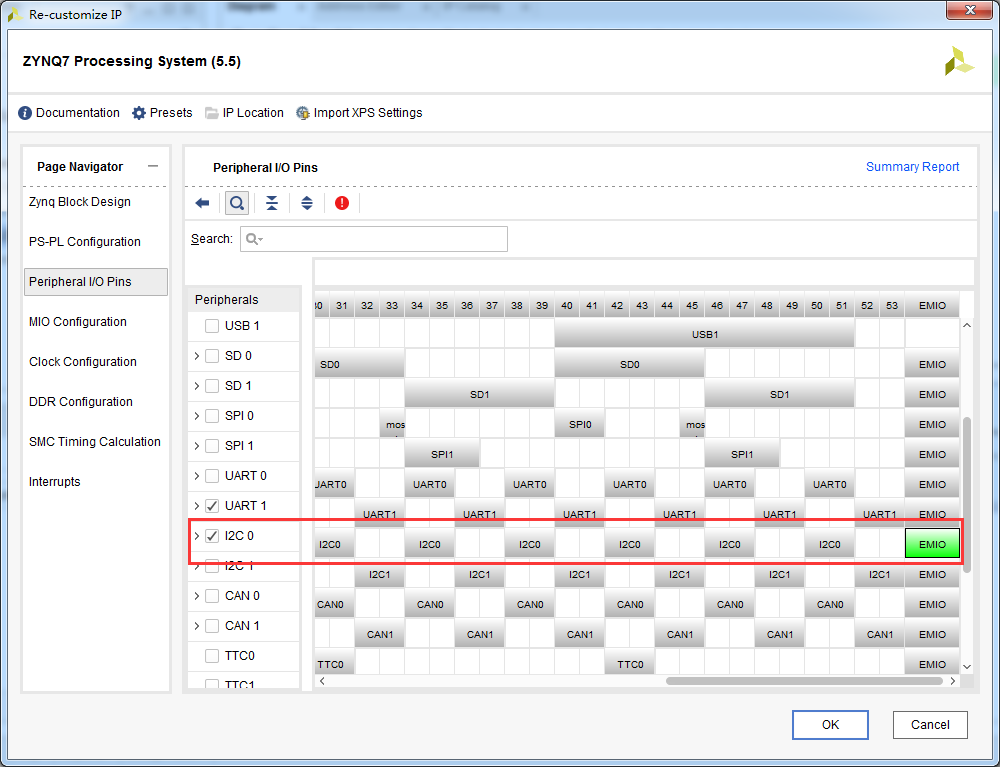
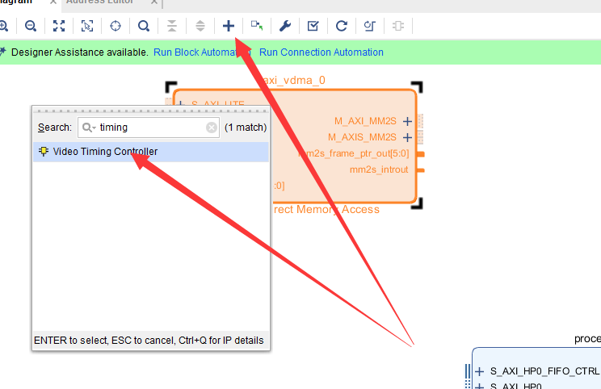
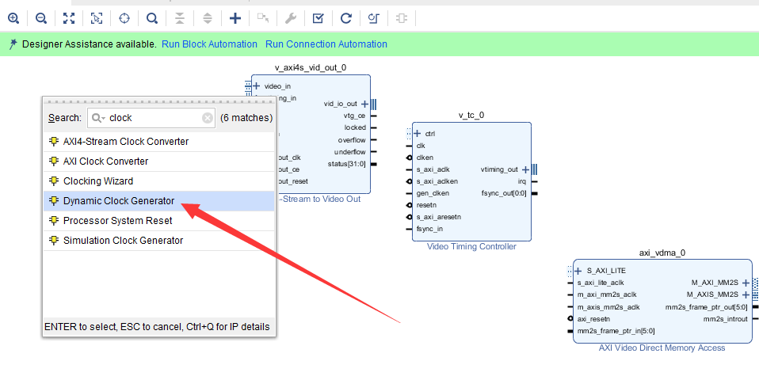
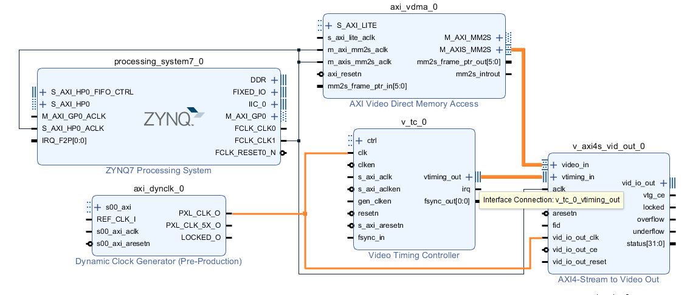
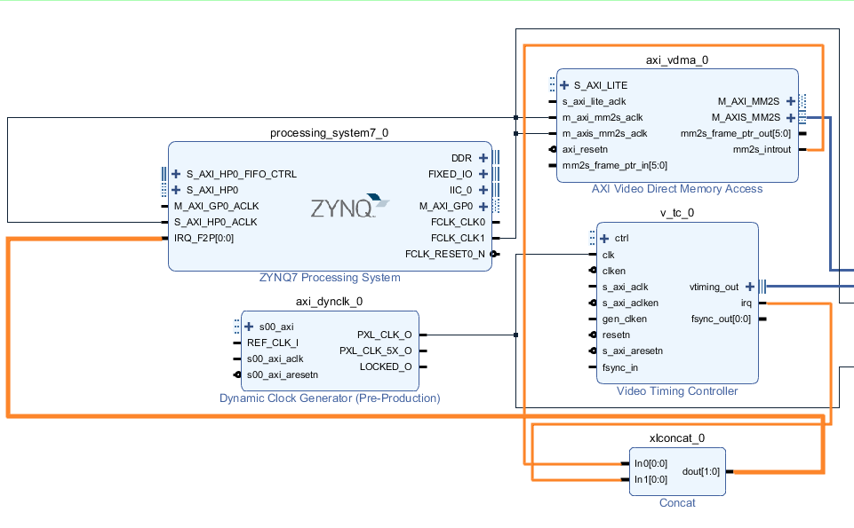
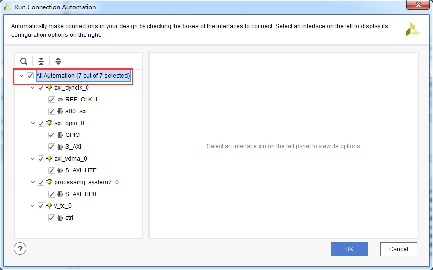
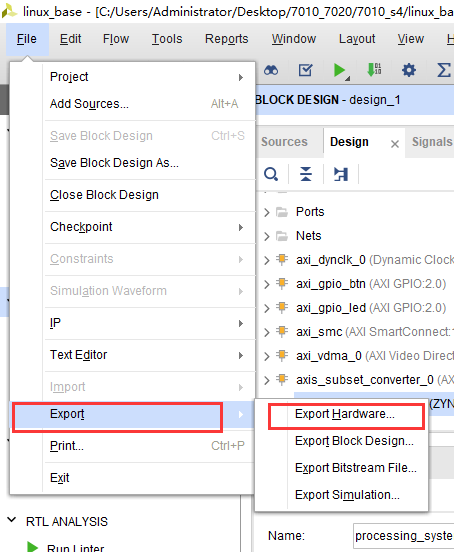

使用VDMA驱动HDMI显示
=======================================

**实验VIvado工程为“vdma_hdmi_out”。**

PS没有集成显示控制系统，需要借助PL来实现，实现的方案有很多，但是都离不开DMA系统，DMA系统可以完成显示数据从ddr3读出到显示器的显示，降低CPU的开销，VDMA是xilinx开发的特殊DMA，专门用于视频输入输出，是学习xilinx
FPGA视频处理的重要内容。

前面的HDMI显示数据是PL内部产生的，这个实验中显示数据是PS生成的，然后PL通过VDMA送给HDMI接口。

Vivado工程建立
--------------

由于VDMA显示是一个非常重要的内容，本实验会详细介绍Vivado的搭建过程。

1) 新建一个名为“vdma_hdmi_out”工程。

.. image:: images/15_media/image1.png
   :width: 6.00417in
   :height: 5.06613in

2) 创建一个Block设计

.. image:: images/15_media/image2.png
   :width: 6.00417in
   :height: 3.98419in

3) 设计名称保持默认不变

.. image:: images/15_media/image3.png
   :width: 6.00417in
   :height: 3.20724in

4) 添加ZYNQ处理器

5) 配置ZYNQ参数，使能HP0接口，用于VDMA快速读取ddr。

.. image:: images/15_media/image5.png
   :width: 6.00417in
   :height: 4.60621in

6) 配置Bnak电平标准，Bank0为LVCMOS 3.3V，Bank1 为 LVCMOS 1.8V，使能串口

7) 使能I2C0，并且选择EMIO，这样可以把I2C连接到PL端。

8) 配置时钟，FCLK_CLK0配置为100Mhz，FCLK_CLK1配置为142Mhz，这个时钟用于VDMA读取数据。

9) 配置ddr3，选择MT41256M16 RE-125

.. image:: images/15_media/image9.png
   :width: 6.00417in
   :height: 4.60621in

10) 配置中断，使能IRQ_F2P，接收PL端的中断

11) 添加VDMA IP

12) 按照下图配置VDMA基本参数

13) 配置VDMA高级参数

.. image:: images/15_media/image13.png
   :width: 6.00417in
   :height: 4.40724in

14) 添加视频时序控制器

15) 配置视频时序控制器参数

.. image:: images/15_media/image15.png
   :width: 5.80616in
   :height: 4.46696in

16) 添加AXI流转视频输出控制器

17) 配置AXI流转视频输出控制器参数

.. image:: images/15_media/image17.png
   :width: 5.67085in
   :height: 4.3505in

18) 由于视频有很多分辨率，各种分辨的时钟频率不相同，需要使用一个动态时钟控制器，这个IP来自开源软件，找到例程里的repo目录，复制到自己的目录下

.. image:: images/15_media/image18.png
   :width: 6.00417in
   :height: 2.35022in

19) 添加IP仓库

.. image:: images/15_media/image19.png
   :width: 6.00417in
   :height: 2.43366in

20) 添加完成以后可以看到很多IP

.. image:: images/15_media/image20.png
   :width: 5.27815in
   :height: 3.65456in

21) 添加动态时钟控制器

22) 连接Vivado可能无法自动连接的时钟信号

.. image:: images/15_media/image22.png
   :width: 6.00417in
   :height: 4.63579in

23) 连接其他一些关键信号

24) 连接中断信号，需要先添加一个Concat IP，用于信号连接

.. image:: images/15_media/image24.png
   :width: 4.3984in
   :height: 3.56487in

25) 使用Vivado自动连接功能，完成剩下的线连接

.. image:: images/15_media/image26.png
   :width: 6.00417in
   :height: 4.41249in

26) 选择所有模块自动连接

27) 运行“Run Block Automation”完成一些必要的端口导出

.. image:: images/15_media/image28.png
   :width: 6.00417in
   :height: 3.65747in

28) 展开vid_io_out端口

.. image:: images/15_media/image29.png
   :width: 3.50604in
   :height: 2.66922in

29) 选择我们需要的端口导出

.. image:: images/15_media/image30.png
   :width: 4.72278in
   :height: 3.39002in

30) 导出IIC_0端口

.. image:: images/15_media/image31.png
   :width: 5.36301in
   :height: 3.89864in

31) 导出视频时钟端口

.. image:: images/15_media/image32.png
   :width: 4.59031in
   :height: 3.24711in

32) 名称修改为hdmi_out_clk

.. image:: images/15_media/image33.png
   :width: 5.00952in
   :height: 4.46904in

33) 修改其他端口的名称

.. image:: images/15_media/image34.png
   :width: 5.434in
   :height: 4.55249in

34) 保存设计后按F6 检查设计，没有问题后创建HDL文件

.. image:: images/15_media/image35.png
   :width: 5.32187in
   :height: 3.68061in

35) 添加HDMI输出的xdc文件，约束管脚

.. image:: images/15_media/image36.png
   :width: 6.00417in
   :height: 3.94619in

36) xdc文件内容如下

+-----------------------------------------------------------------------+
| set_property BITSTREAM.GENERAL.COMPRESS TRUE [current_design]         |
|                                                                       |
| set_property CONFIG_VOLTAGE 3.3 [current_design]                      |
|                                                                       |
| set_property CFGBVS VCCO [current_design]                             |
|                                                                       |
| set_property BITSTREAM.CONFIG.UNUSEDPIN PULLUP [current_design]       |
|                                                                       |
| set_property PACKAGE_PIN K13 [get_ports hdmi_out_clk]                 |
|                                                                       |
| set_property PACKAGE_PIN G16 [get_ports {hdmi_out_data[0]}]           |
|                                                                       |
| set_property PACKAGE_PIN E16 [get_ports {hdmi_out_data[1]}]           |
|                                                                       |
| set_property PACKAGE_PIN J15 [get_ports {hdmi_out_data[2]}]           |
|                                                                       |
| set_property PACKAGE_PIN E15 [get_ports {hdmi_out_data[3]}]           |
|                                                                       |
| set_property PACKAGE_PIN F15 [get_ports {hdmi_out_data[4]}]           |
|                                                                       |
| set_property PACKAGE_PIN G15 [get_ports {hdmi_out_data[5]}]           |
|                                                                       |
| set_property PACKAGE_PIN F14 [get_ports {hdmi_out_data[6]}]           |
|                                                                       |
| set_property PACKAGE_PIN H14 [get_ports {hdmi_out_data[7]}]           |
|                                                                       |
| set_property PACKAGE_PIN J13 [get_ports {hdmi_out_data[8]}]           |
|                                                                       |
| set_property PACKAGE_PIN K12 [get_ports {hdmi_out_data[9]}]           |
|                                                                       |
| set_property PACKAGE_PIN B11 [get_ports {hdmi_out_data[10]}]          |
|                                                                       |
| set_property PACKAGE_PIN C12 [get_ports {hdmi_out_data[11]}]          |
|                                                                       |
| set_property PACKAGE_PIN D13 [get_ports {hdmi_out_data[12]}]          |
|                                                                       |
| set_property PACKAGE_PIN A12 [get_ports {hdmi_out_data[13]}]          |
|                                                                       |
| set_property PACKAGE_PIN C13 [get_ports {hdmi_out_data[14]}]          |
|                                                                       |
| set_property PACKAGE_PIN A13 [get_ports {hdmi_out_data[15]}]          |
|                                                                       |
| set_property PACKAGE_PIN D14 [get_ports {hdmi_out_data[16]}]          |
|                                                                       |
| set_property PACKAGE_PIN D15 [get_ports {hdmi_out_data[17]}]          |
|                                                                       |
| set_property PACKAGE_PIN A14 [get_ports {hdmi_out_data[18]}]          |
|                                                                       |
| set_property PACKAGE_PIN B14 [get_ports {hdmi_out_data[19]}]          |
|                                                                       |
| set_property PACKAGE_PIN A15 [get_ports {hdmi_out_data[20]}]          |
|                                                                       |
| set_property PACKAGE_PIN B15 [get_ports {hdmi_out_data[21]}]          |
|                                                                       |
| set_property PACKAGE_PIN D16 [get_ports {hdmi_out_data[22]}]          |
|                                                                       |
| set_property PACKAGE_PIN B16 [get_ports {hdmi_out_data[23]}]          |
|                                                                       |
| set_property PACKAGE_PIN K15 [get_ports hdmi_out_de]                  |
|                                                                       |
| set_property PACKAGE_PIN C11 [get_ports hdmi_out_hs]                  |
|                                                                       |
| set_property PACKAGE_PIN B12 [get_ports hdmi_out_vs]                  |
|                                                                       |
| set_property PACKAGE_PIN A17 [get_ports hdmi_i2c_scl_io]              |
|                                                                       |
| set_property PACKAGE_PIN C16 [get_ports hdmi_i2c_sda_io]              |
|                                                                       |
| set_property IOSTANDARD LVCMOS18 [get_ports hdmi_i2c_scl_io]          |
|                                                                       |
| set_property IOSTANDARD LVCMOS18 [get_ports hdmi_i2c_sda_io]          |
|                                                                       |
| set_property IOSTANDARD LVCMOS18 [get_ports hdmi_out_clk]             |
|                                                                       |
| set_property IOSTANDARD LVCMOS18 [get_ports hdmi_out_de]              |
|                                                                       |
| set_property IOSTANDARD LVCMOS18 [get_ports hdmi_out_hs]              |
|                                                                       |
| set_property IOSTANDARD LVCMOS18 [get_ports {hdmi_out_data[*]}]       |
|                                                                       |
| set_property IOSTANDARD LVCMOS18 [get_ports hdmi_out_vs]              |
|                                                                       |
| set_property SLEW FAST [get_ports {hdmi_out_data[*]}]                 |
|                                                                       |
| set_property DRIVE 8 [get_ports {hdmi_out_data[*]}]                   |
|                                                                       |
| set_property SLEW FAST [get_ports hdmi_out_clk]                       |
|                                                                       |
| set_property SLEW FAST [get_ports hdmi_out_de]                        |
|                                                                       |
| set_property SLEW FAST [get_ports hdmi_out_hs]                        |
|                                                                       |
| set_property SLEW FAST [get_ports hdmi_out_vs]                        |
+-----------------------------------------------------------------------+

1)  编译生成bit文件

Vitis软件编写调试
-----------------

1) 导出硬件

.. image:: images/15_media/image38.png
   :width: 3.75625in
   :height: 3.18333in

2) 运行Vitis，新建一个名为vdma_hdmi的APP，已经预备了相关程序

.. image:: images/15_media/image39.png
   :width: 2.41025in
   :height: 2.62993in

3) 由于程序文件较多，不再具体介绍，直接复制例程的源代码。删除src目录下的文件，使用例程的src目录文件代替

4) 在Vitis下按F5刷新

5) 在display_ctrl文件夹中，diplay_ctrl.c主要是显示的控制，vga_mode.h中加入了一些显示分辨率的时序参数。

.. image:: images/15_media/image41.png
   :width: 5.11389in
   :height: 2.52569in

在display_ctrl.c中，可以修改displayPtr->vMode，改变显示的分辨率。

.. image:: images/15_media/image42.png
   :width: 6.00417in
   :height: 2.96042in

6) Dynclk文件中，主要功能是根据不同的分辨率配置锁相环的时钟输出，产生像素时钟。

.. image:: images/15_media/image43.png
   :width: 2.83179in
   :height: 2.92993in

7) 连接HDMI输出端口到显示器，编译运行

.. image:: images/15_media/image44.png
   :width: 4.63819in
   :height: 3.16389in

8) 显示器显示出一幅图片

.. image:: images/15_media/image45.jpeg
   :width: 3.89097in
   :height: 2.52292in

*ZYNQ-7000开发平台 FPGA教程*    - `Alinx官方网站 <http://www.alinx.com>`_