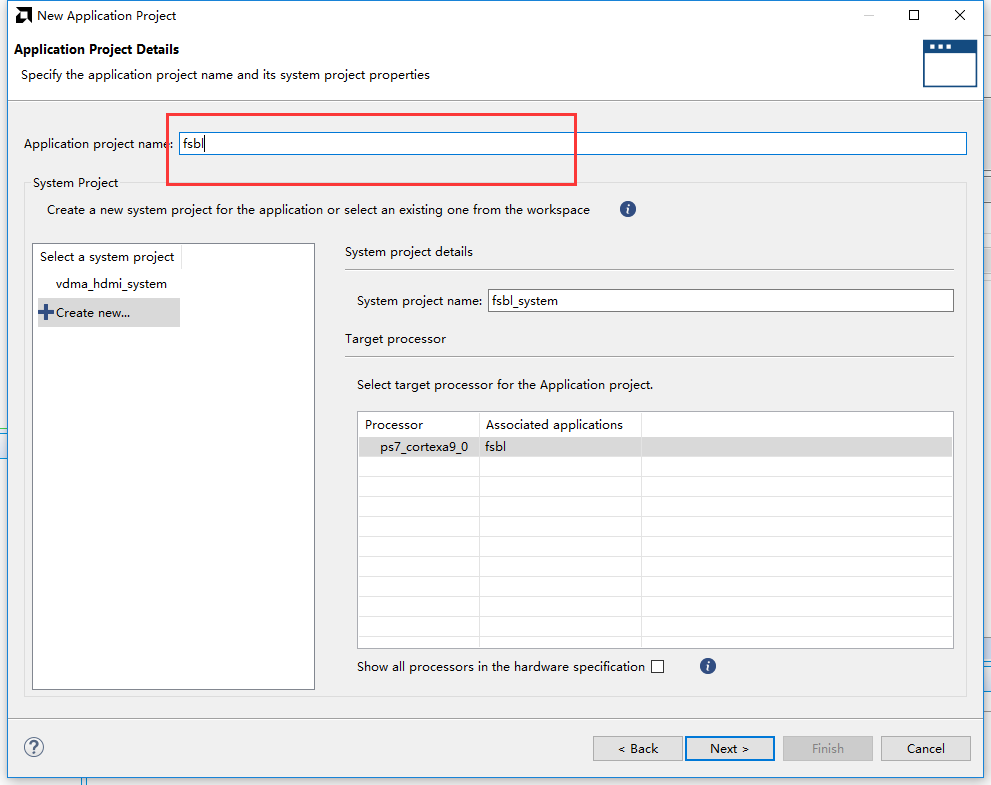
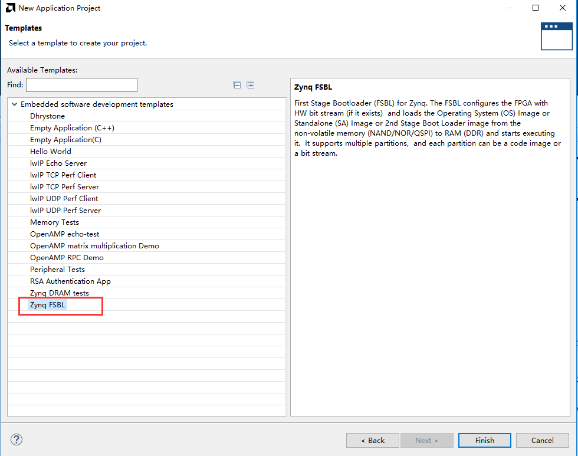
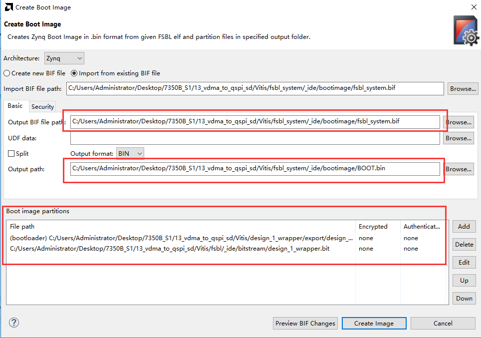
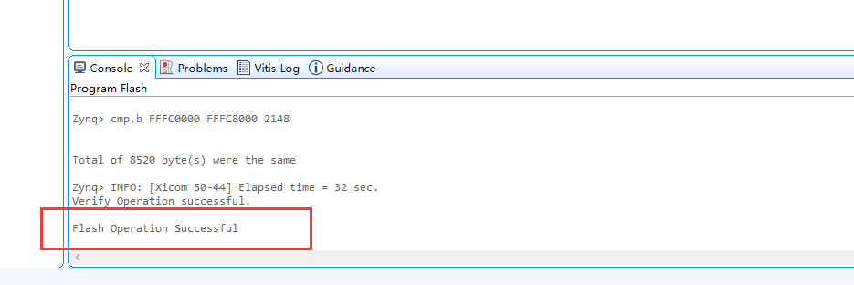

固化程序
=========================

**实验VIvado工程为“vdma_to_qspi_sd”。**

做个这么多试验，都是通过JTAG调试的，怎么把程序放在SD卡或者烧写到QSPI
Flash里运行？首先PL必须有PS配置，所以不能像以往的FPGA烧录方法直接烧录到Flash，本实验讲解如何固化程序。

Vivado工程建立
--------------

本实验选择VDMA测试工程来固化，在建立VDMA测试工程时，我们没有使能QSPI和SD卡，要固化程序必须使能QSPI或SD卡。

1) 将VDMA测试工程另存一份，用于固化程序实验，名称改为“vdma_to_qspi_sd”

.. image:: images/16_media/image1.png
   :width: 5.37441in
   :height: 2.88394in

2) 添加QSPI，使用MIO1-6

3) 添加SD0控制器，使用MIO40-45，使用TF卡接口

.. image:: images/16_media/image3.png
   :width: 6.00417in
   :height: 4.60621in

4) 添加SD卡的卡检测管脚MIO10

.. image:: images/16_media/image4.png
   :width: 6.00417in
   :height: 4.60621in

5) 保存设计，编译生成bit文件，再次导出硬件

生成FSBL
--------

FSBL是一个二级引导程序，完成MIO的分配、DDR控制器初始化、SD、QSPI控制器初始化，配置FPGA，然后加载用户程序。

1) 启动Vitis软件。

.. image:: images/16_media/image5.png
   :width: 5.99306in
   :height: 3.59167in

2) 新建一个名为fsbl的APP。

3) 模板选择Zynq FSBL

4) 添加调试宏定义FSBL_DEBUG_INFO，可以在启动输出FSBL的一些状态信息，有利于调试，但是会导致启动时间变长。

.. image:: images/16_media/image8.png
   :width: 5.99931in
   :height: 3.97361in

5) 保存编译Vitis，生成fsbl.elf文件

创建BOOT文件
------------

1) 选择fsbl工程，右键选择Create Boot Image

.. image:: images/16_media/image9.png
   :width: 5.99444in
   :height: 4.01389in

2) 弹出的窗口中可以看到生成的BIF文件路径，BIF文件是生成BOOT文件的配置文件，还有生成的BOOT.bin文件路径，BOOT.bin文件是我们需要的启动文件，可以放到SD卡启动，也可以烧写到QSPI
   Flash。

3) 在Boot image
   partitions列表中有要合成的文件，第一个文件一定是bootloader文件，就是上面生成的fsbl.elf文件，第二个文件是FPGA配置文件，现在点击Add添加我们的VDMA测试程序vdma_hdmi.elf

.. image:: images/16_media/image11.png
   :width: 6.00417in
   :height: 3.77431in

4) 点击Create Image生成

.. image:: images/16_media/image12.png
   :width: 6.00347in
   :height: 4.16319in

5) 在生成的目录下可以找到BOOT.bin文件

.. image:: images/16_media/image13.png
   :width: 5.99653in
   :height: 2.83958in

SD卡启动测试
------------

1) 格式化SD卡，只能格式化为FAT32格式，其他格式无法启动

2) 放入BOOT.bin文件，放在根目录

3) SD卡插入开发板的SD卡插槽

4) 启动模式调整为SD卡启动

5) 插上HDMI显示器，给开发板上电，可以看到显示器显示了小猫的图片

QSPI启动测试
------------

1) 在菜单Vitis -> Program Flash

.. image:: images/16_media/image16.png
   :width: 6.00278in
   :height: 4.36389in

2) Image FIle文件选择要烧写的BOOT.bin，模式调整为JTAG。

.. image:: images/16_media/image17.png
   :width: 6in
   :height: 2.18611in

关于定制版本fsbl的来源，可以参考xilinx官网链接：\ https://www.xilinx.com/support/answers/70148.html

（如果链接失效，可以在xilinx官网搜索AR# 70148）

   .. image:: images/16_media/image18.png
      :width: 4.74202in
      :height: 4.89888in

   .. image:: images/16_media/image19.png
      :width: 4.79348in
      :height: 3.62754in

**注意：**\ 如果使用Vivado
2019.1及以后版本就不需要这个定制的fsbl，用自己生成的fsbl即可。

3) 点击Program等待烧写完成

4) 烧写完成后设置启动模式为QSPI，再次启动，可以看到显示器有显示输出

Vivado下烧写QSPI 
-----------------

1) 在HARDWARE MANGER下选择器件，右键Add Configuration Memory Device

.. image:: images/16_media/image21.png
   :width: 5.2453in
   :height: 5.05301in

2) 选择尝试Winbond，类型选择qspi，宽度选择x4-single，这时候出现一个w25q128，开发板使用w25q256，但是不影响烧录。

.. image:: images/16_media/image22.png
   :width: 5.69145in
   :height: 4.49577in

3) 右键选择编程文件

4) 选择要烧写的文件和芯驿电子定制的fsbl文件，就可以烧写了，如果烧写时不是JTAG启动模式，软件会给出一个警告，所以建议烧写QSPI的时候设置到JTAG启动模式

.. image:: images/16_media/image24.png
   :width: 5.54874in
   :height: 4.14932in
 

*ZYNQ-7000开发平台 FPGA教程*    - `Alinx官方网站 <http://www.alinx.com>`_